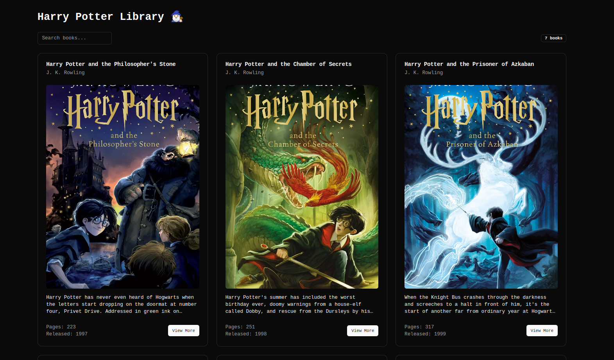
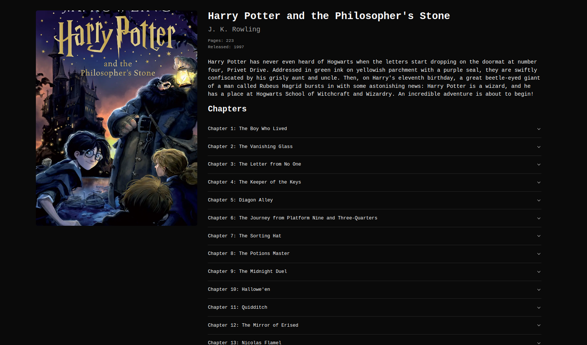

# Harry Potter books technical test

Welcome to the Harry Potter books technical test! 🧙‍♂️

Please read the following instructions **carefully**.

## Summary

- [Harry Potter books technical test](#harry-potter-books-technical-test)
  - [Summary](#summary)
  - [Technologies used](#technologies-used)
  - [How to run the project](#how-to-run-the-project)
  - [Your mission](#your-mission)
    - [Requirements](#requirements)
      - [Mission 1](#mission-1)
      - [Mission 2](#mission-2)
  - [Expected result](#expected-result)
  - [Good luck! 🚀](#good-luck-)

## Technologies used

- TypeScript: V 5.0.0
- React: V 19.0.0
- Next.js: V 15.1.0
- Tailwind CSS: V 3.4.1
- Axios: V 1.7.9
- ShadCn

## How to run the project

> 🚨 **WARNING**
>
> **You don't need to add any configuration to run the project, the project is already configured to run with the default configuration.**
>
> **It has Tailwind CSS, TypeScript, and ShadCn.**

1. Clone the repository

```bash
git clone git@gitlab.com:adn-expertise/waialys-technical-test-harry-potter.git
```

2. Install the dependencies

```bash
pnpm install
```

3. Run the project

```bash
pnpm dev
```

The project will be available at [http://localhost:3000](http://localhost:3000)

## Your mission

Your mission, should you choose to accept it, is to fetch the data from the Harry Potter API and display it in a user-friendly way.

At your disposal, you have the following:

- The Harry Potter DB API: [Click here](https://docs.potterdb.com/apis/rest)
- The API base URL: [Click here](./src/consts/index.ts)
- You should browse the SadCn documentation to see how to use the needed components: [Click here](https://ui.shadcn.com/docs/components)

### Requirements

You can see a live demo of the expected result here: [Click here](./assets/demo.mp4)

> 🚨 **WARNING**
>
> Your components and API responses should be typed.

#### Mission 1

- On the home page, you should add your first and last name. (the page is already created)
- You should create a page with the appropriate route to display the list of Harry Potter books.
- That page should have:
  - A header with the title "Harry Potter books"
  - A search bar that will allow the user to search for a book by its title.
    - If the user types a title, the books that `includes` the typed title should be displayed.
    - If the user types an empty string, all the books should be displayed.
    - If the user types a title that doesn't exist, a message should be displayed: "No books found".
  - A `Badge` component that will display the number of books found.
  - The list of books fetched from the API in a `Card` component.
  - Each card should have the following information:
    - The book title
    - The book author
    - The book cover _(an image)_
    - The book description _(3 lines max)_
    - The book release year



> ⚠️ **NOTE**:
>
> No pagination is required, you can display all the books at once.
>
> The design may not be pixel-perfect, but the information should be displayed in a user-friendly way.
>
> Responsive design is **REQUIRED**.

> ℹ️ **TIP**
>
> Use the [`ShadCn`](https://ui.shadcn.com/docs/components) components to create the page.
>
> You already have `axios` installed to fetch the data from the API.

#### Mission 2

- You should create a page with the appropriate route to display the details of a book.
- That page should have:
  - The book cover _(an image)_
  - The book title
  - The book author
  - The book number of pages
  - The book release year
  - The book description _(all of it)_
  - The book chapters in an `Accordion` component.
    - The title of the chapter is the `Accordion` title.
    - Upon clicking on the chapter, the content of the chapter should be displayed.
    - If the chapter has **no content**, you should `disable` the `Accordion` and the text color should be `gray`.



> ⚠️ **NOTE**:
>
> The design may not be pixel-perfect, but the information should be displayed in a user-friendly way.
>
> Responsive design is **NOT required**. But it's **a plus** if you can make it responsive.

> ℹ️ **TIP**
>
> Use the [`ShadCn`](https://ui.shadcn.com/docs/components) components to create the page.
>
> You already have `axios` installed to fetch the data from the API.

## Expected result

Within 2 days, you should have a pull request with the following:

- A branch with your first and last name. _(e.g. `john-doe`)_
- The implementation of the two missions.

> ℹ️ **TIP**
>
> You may delete the `assets` folder or the `demo.mp4` file before creating the pull request.
>
> This will make your pull request lighter.

## Good luck! 🚀

© Waialys DEV 2024
